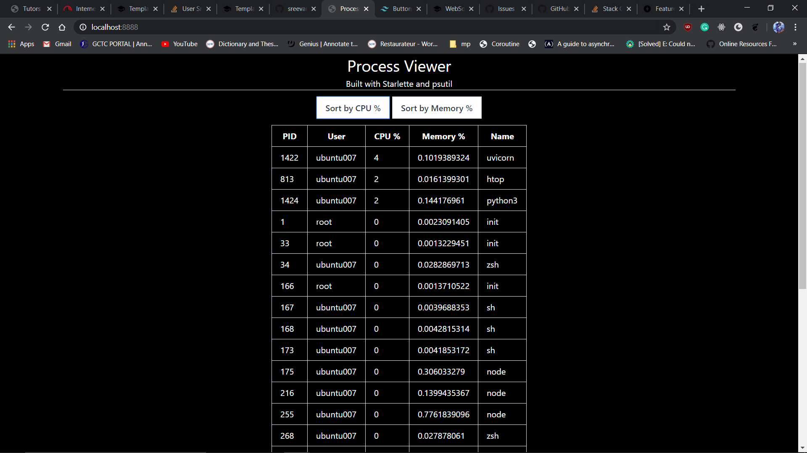

# ps_man a Process Viewer

## Built in python with [Starlette](https://www.starlette.io/) and [psutil](https://psutil.readthedocs.io/en/latest/)

### start the app by running

```console
uvicorn app:app --port 8888
```


